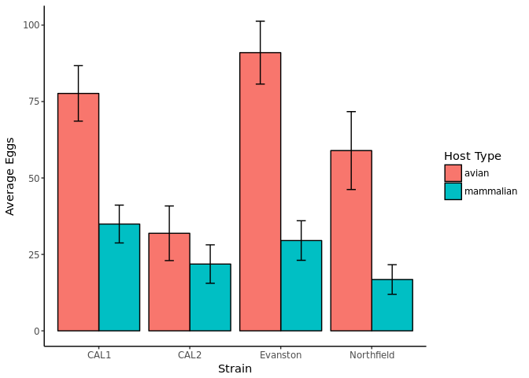
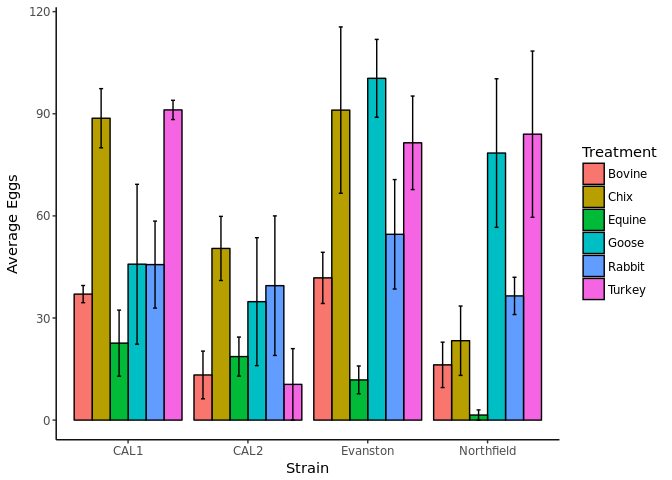

*Culex pipiens* egg production depends upon vertebrate blood host species
================
Cuadera, M.K, and Fritz, M. L.
7/6/2018

#### Background

The *Culex pipiens* species is part of the Culex assemblage. Within the species itself, there exists two major bioforms: form pipiens and form molestus. *Cx. pip* form pipiens are aboveground mosquitoes that feed primarily in avian blood, while the *Cx. pip* form molestus are underground mosquitoes that feed primarily in mammalian blood. Though host preference has been previously demostrated, the reason as to why these preferences exist is unknown. The purpose of this work is to analyze the effects of different mammalian and avian host blood on the fecundity of above ground and below ground *Cx. pipiens* mosquitoes to see whether mosquitoes produce the most eggs when feeding on their preferred hosts.

#### Analytical Methods

##### Summary function

The function below takes the main data frame and outputs a new dataframe that includes the mean, standard deviation, and number of replicates.

``` r
data_summary <- function(data, varname, groupnames){
  require(plyr)
  summary_func <- function(x, col){
    c(mean = mean(x[[col]], na.rm=TRUE),
      sd = sd(x[[col]], na.rm=TRUE),
      No_Replicates = length(x[[col]]))}
  
  data_sum<-ddply(data, groupnames, .fun=summary_func,
                  varname)
  data_sum <- rename(data_sum, c("mean" = varname))
  return(data_sum)
}
```

##### Bootstrapping function

``` r
boot.fn <- function(x, N=5000) {
  Int.1 <- replicate(N, mean(sample(x, size= length(x), replace=T)))
  Int.CI <- quantile(Int.1, probs=c(0.025,0.975))
  Int.CI
}
```

##### Setting up the main dataset

``` r
#Mervin uses this
#Exp_1_data <- read.csv(file = "~/Desktop/Mervin-Culex_Fitness_By_Blood/data/Exp1_Host_Blood_Fitness_Study_Replicates.csv",header = T)
#Megan uses this
Exp_1_data <- read.csv(file = "~/Desktop/Culex_Fitness_By_Blood/data/Exp1_Host_Blood_Fitness_Study_Replicates.csv",header = T)
head(Exp_1_data)
Exp_1_data$No_eggs_per_fem <- Exp_1_data$Total_Egg_Produced/Exp_1_data$No_Fed
Fed_only <- subset(Exp_1_data, No_Fed > 0)

str(Fed_only)
Fed_only_mammalian <- subset(Fed_only, Host_Type =="mammalian")
Fed_only_avian <- subset(Fed_only, Host_Type == "avian")
Fed_only_molestus <- subset(Fed_only, Form =="m")
Fed_only_pip <- subset(Fed_only, Form =="p")

Fed_only_mol_bovine <- subset(Fed_only_molestus, Treatment =="Bovine")
Fed_only_mol_rabbit <- subset(Fed_only_molestus, Treatment =="Rabbit")
Fed_only_mol_equine <- subset(Fed_only_molestus, Treatment =="Equine")
Fed_only_mol_goose <- subset(Fed_only_molestus, Treatment =="Goose")
Fed_only_mol_chicken <- subset(Fed_only_molestus, Treatment =="Chix")
Fed_only_mol_turkey <- subset(Fed_only_molestus, Treatment =="Turkey")

Fed_only_pip_bovine <- subset(Fed_only_pip, Treatment =="Bovine")
Fed_only_pip_rabbit <- subset(Fed_only_pip, Treatment =="Rabbit")
Fed_only_pip_equine <- subset(Fed_only_pip, Treatment =="Equine")
Fed_only_pip_goose <- subset(Fed_only_pip, Treatment =="Goose")
Fed_only_pip_chicken <- subset(Fed_only_pip, Treatment =="Chix")
Fed_only_pip_turkey <- subset(Fed_only_pip, Treatment =="Turkey")
```

##### Setting up the libraries needed

``` r
library (lme4)
```

    ## Loading required package: Matrix

``` r
library(ggplot2)
library(car)
library(plyr)
```

##### Table summary of the data

Table summary with the standard error calculated.

``` r
Exp_1_Data_Summary <- data_summary(Fed_only, varname = "No_eggs_per_fem", groupnames = c("Strain", "Treatment"))
Exp_1_Data_Summary$se <- Exp_1_Data_Summary$sd / sqrt(Exp_1_Data_Summary$No_Replicates)
```

``` r
head(Exp_1_Data_Summary)
```

    ##   Strain Treatment No_eggs_per_fem        sd No_Replicates        se
    ## 1   CAL1    Bovine        37.02778  4.375066             3  2.525946
    ## 2   CAL1      Chix        88.69307 19.437639             5  8.692777
    ## 3   CAL1    Equine        22.61964 19.412873             4  9.706437
    ## 4   CAL1     Goose        45.80556 40.667720             3 23.479519
    ## 5   CAL1    Rabbit        45.68750 25.554623             4 12.777312
    ## 6   CAL1    Turkey        91.13043  4.896422             3  2.826951

``` r
Exp_1_Data_Host_Type <-data_summary(Fed_only, varname = "No_eggs_per_fem", groupnames = c("Strain", "Host_Type"))
Exp_1_Data_Host_Type$se <- Exp_1_Data_Host_Type$sd / sqrt(Exp_1_Data_Host_Type$No_Replicates)
```

``` r
head(Exp_1_Data_Host_Type)
```

    ##     Strain Host_Type No_eggs_per_fem       sd No_Replicates        se
    ## 1     CAL1     avian        77.66121 30.10661            11  9.077486
    ## 2     CAL1 mammalian        34.93745 20.51890            11  6.186682
    ## 3     CAL2     avian        31.91481 26.79542             9  8.931806
    ## 4     CAL2 mammalian        21.85000 17.75452             8  6.277170
    ## 5 Evanston     avian        90.99377 37.07249            13 10.282058
    ## 6 Evanston mammalian        29.54251 24.20256            14  6.468405

#### Graphs of the Data

##### Average egg production when looking at host type alone

Looking at host type alone, all strains seem to do well when fed avian blood. Error bars represent standard errors (alpha = 0.05) 

##### Average egg production per treatment

The graph below summarizes the average egg production for all treatments. Error bars represent standard error (alpha = 0.05) 

#### Linear Model With Mixed Effects for the Data

The linear mixed effects model attempts to explain egg production with respect to strain and treatment, including their interaction and the random effect caused by performing the experiment in replicates over a wide span of time.

``` r
model_Full1 <- lmer(No_eggs_per_fem ~ 1 + Strain*Treatment + (1|Replicate), data = Fed_only)
```

    ## Warning: 'rBind' is deprecated.
    ##  Since R version 3.2.0, base's rbind() should work fine with S4 objects

``` r
summary(model_Full1)
```

    ## 
    ## Correlation matrix not shown by default, as p = 24 > 12.
    ## Use print(x, correlation=TRUE)  or
    ##   vcov(x)     if you need it

#### Statistical Analysis

##### ANOVA

A two-way ANOVA indicates that host and strain are signficant factors that impact egg production. The interaction between host and strain is moderately significant.

``` r
Host_Anova <- aov(No_eggs_per_fem ~ Host_Type*Strain, data = Fed_only)
summary(Host_Anova)
```

    ##                  Df Sum Sq Mean Sq F value   Pr(>F)    
    ## Host_Type         1  39232   39232  44.340 2.68e-09 ***
    ## Strain            3  16070    5357   6.054 0.000879 ***
    ## Host_Type:Strain  3   6873    2291   2.589 0.058262 .  
    ## Residuals        84  74324     885                     
    ## ---
    ## Signif. codes:  0 '***' 0.001 '**' 0.01 '*' 0.05 '.' 0.1 ' ' 1

``` r
TukeyHSD(Host_Anova)
```

    ##   Tukey multiple comparisons of means
    ##     95% family-wise confidence level
    ## 
    ## Fit: aov(formula = No_eggs_per_fem ~ Host_Type * Strain, data = Fed_only)
    ## 
    ## $Host_Type
    ##                      diff       lwr       upr p adj
    ## mammalian-avian -41.30066 -53.63483 -28.96649     0
    ## 
    ## $Strain
    ##                           diff        lwr        upr     p adj
    ## CAL2-CAL1           -30.335623 -55.513735 -5.1575109 0.0116231
    ## Evanston-CAL1         3.595648 -18.798342 25.9896381 0.9747671
    ## Northfield-CAL1     -18.417152 -41.003669  4.1693654 0.1498164
    ## Evanston-CAL2        33.931271   9.790749 58.0717933 0.0022515
    ## Northfield-CAL2      11.918471 -12.400755 36.2376978 0.5752225
    ## Northfield-Evanston -22.012800 -43.436577 -0.5890227 0.0416862
    ## 
    ## $`Host_Type:Strain`
    ##                                               diff         lwr        upr
    ## mammalian:CAL1-avian:CAL1               -42.723767  -82.152730  -3.294804
    ## avian:CAL2-avian:CAL1                   -45.746398  -87.308174  -4.184621
    ## mammalian:CAL2-avian:CAL1               -55.811213  -98.777929 -12.844496
    ## avian:Evanston-avian:CAL1                13.332555  -24.549567  51.214678
    ## mammalian:Evanston-avian:CAL1           -48.118707  -85.375576 -10.861839
    ## avian:Northfield-avian:CAL1             -18.697819  -56.579942  19.184303
    ## mammalian:Northfield-avian:CAL1         -60.860251  -98.742374 -22.978129
    ## avian:CAL2-mammalian:CAL1                -3.022631  -44.584408  38.539145
    ## mammalian:CAL2-mammalian:CAL1           -13.087446  -56.054162  29.879271
    ## avian:Evanston-mammalian:CAL1            56.056322   18.174200  93.938445
    ## mammalian:Evanston-mammalian:CAL1        -5.394941  -42.651809  31.861928
    ## avian:Northfield-mammalian:CAL1          24.025948  -13.856175  61.908070
    ## mammalian:Northfield-mammalian:CAL1     -18.136484  -56.018607  19.745638
    ## mammalian:CAL2-avian:CAL2               -10.064815  -54.996728  34.867099
    ## avian:Evanston-avian:CAL2                59.078953   18.981655  99.176251
    ## mammalian:Evanston-avian:CAL2            -2.372310  -41.879427  37.134808
    ## avian:Northfield-avian:CAL2              27.048579  -13.048720  67.145877
    ## mammalian:Northfield-avian:CAL2         -15.113853  -55.211152  24.983445
    ## avian:Evanston-mammalian:CAL2            69.143768   27.591984 110.695552
    ## mammalian:Evanston-mammalian:CAL2         7.692505  -33.290050  48.675060
    ## avian:Northfield-mammalian:CAL2          37.113394   -4.438391  78.665178
    ## mammalian:Northfield-mammalian:CAL2      -5.049038  -46.600823  36.502746
    ## mammalian:Evanston-avian:Evanston       -61.451263  -97.067078 -25.835447
    ## avian:Northfield-avian:Evanston         -32.030374  -68.299745   4.238996
    ## mammalian:Northfield-avian:Evanston     -74.192806 -110.462177 -37.923436
    ## avian:Northfield-mammalian:Evanston      29.420888   -6.194927  65.036703
    ## mammalian:Northfield-mammalian:Evanston -12.741544  -48.357359  22.874271
    ## mammalian:Northfield-avian:Northfield   -42.162432  -78.431803  -5.893061
    ##                                             p adj
    ## mammalian:CAL1-avian:CAL1               0.0241743
    ## avian:CAL2-avian:CAL1                   0.0206755
    ## mammalian:CAL2-avian:CAL1               0.0028760
    ## avian:Evanston-avian:CAL1               0.9563752
    ## mammalian:Evanston-avian:CAL1           0.0031109
    ## avian:Northfield-avian:CAL1             0.7866774
    ## mammalian:Northfield-avian:CAL1         0.0000839
    ## avian:CAL2-mammalian:CAL1               0.9999983
    ## mammalian:CAL2-mammalian:CAL1           0.9803087
    ## avian:Evanston-mammalian:CAL1           0.0003819
    ## mammalian:Evanston-mammalian:CAL1       0.9998179
    ## avian:Northfield-mammalian:CAL1         0.5069239
    ## mammalian:Northfield-mammalian:CAL1     0.8114976
    ## mammalian:CAL2-avian:CAL2               0.9968903
    ## avian:Evanston-avian:CAL2               0.0004113
    ## mammalian:Evanston-avian:CAL2           0.9999996
    ## avian:Northfield-avian:CAL2             0.4253680
    ## mammalian:Northfield-avian:CAL2         0.9377122
    ## avian:Evanston-mammalian:CAL2           0.0000412
    ## mammalian:Evanston-mammalian:CAL2       0.9989931
    ## avian:Northfield-mammalian:CAL2         0.1150065
    ## mammalian:Northfield-mammalian:CAL2     0.9999441
    ## mammalian:Evanston-avian:Evanston       0.0000190
    ## avian:Northfield-avian:Evanston         0.1236433
    ## mammalian:Northfield-avian:Evanston     0.0000003
    ## avian:Northfield-mammalian:Evanston     0.1825578
    ## mammalian:Northfield-mammalian:Evanston 0.9524450
    ## mammalian:Northfield-avian:Northfield   0.0115311

##### T-Test

Treatments were compared within the *molestus* form. A significant difference was found in the chicken and turkey treatments, with CAL1 having the greatest average egg production for both.

``` r
t.test(No_eggs_per_fem~Strain, data = Fed_only_mol_bovine)
```

    ## 
    ##  Welch Two Sample t-test
    ## 
    ## data:  No_eggs_per_fem by Strain
    ## t = 3.1909, df = 2.5114, p-value = 0.0634
    ## alternative hypothesis: true difference in means is not equal to 0
    ## 95 percent confidence interval:
    ##  -2.771222 50.293445
    ## sample estimates:
    ## mean in group CAL1 mean in group CAL2 
    ##           37.02778           13.26667

``` r
t.test(No_eggs_per_fem~Strain, data = Fed_only_mol_chicken)
```

    ## 
    ##  Welch Two Sample t-test
    ## 
    ## data:  No_eggs_per_fem by Strain
    ## t = 2.9838, df = 5.0317, p-value = 0.03042
    ## alternative hypothesis: true difference in means is not equal to 0
    ## 95 percent confidence interval:
    ##   5.359572 71.137686
    ## sample estimates:
    ## mean in group CAL1 mean in group CAL2 
    ##           88.69307           50.44444

``` r
t.test(No_eggs_per_fem~Strain, data = Fed_only_mol_equine)
```

    ## 
    ##  Welch Two Sample t-test
    ## 
    ## data:  No_eggs_per_fem by Strain
    ## t = 0.35066, df = 4.6155, p-value = 0.7413
    ## alternative hypothesis: true difference in means is not equal to 0
    ## 95 percent confidence interval:
    ##  -25.76612  33.67207
    ## sample estimates:
    ## mean in group CAL1 mean in group CAL2 
    ##           22.61964           18.66667

``` r
t.test(No_eggs_per_fem~Strain, data = Fed_only_mol_goose)
```

    ## 
    ##  Welch Two Sample t-test
    ## 
    ## data:  No_eggs_per_fem by Strain
    ## t = 0.36594, df = 3.8169, p-value = 0.7338
    ## alternative hypothesis: true difference in means is not equal to 0
    ## 95 percent confidence interval:
    ##  -74.09839  96.10950
    ## sample estimates:
    ## mean in group CAL1 mean in group CAL2 
    ##           45.80556           34.80000

``` r
t.test(No_eggs_per_fem~Strain, data = Fed_only_mol_rabbit)
```

    ## 
    ##  Welch Two Sample t-test
    ## 
    ## data:  No_eggs_per_fem by Strain
    ## t = 0.25615, df = 1.8355, p-value = 0.8237
    ## alternative hypothesis: true difference in means is not equal to 0
    ## 95 percent confidence interval:
    ##  -107.2012  119.5762
    ## sample estimates:
    ## mean in group CAL1 mean in group CAL2 
    ##            45.6875            39.5000

``` r
t.test(No_eggs_per_fem~Strain, data = Fed_only_mol_turkey)
```

    ## 
    ##  Welch Two Sample t-test
    ## 
    ## data:  No_eggs_per_fem by Strain
    ## t = 7.415, df = 2.2884, p-value = 0.01204
    ## alternative hypothesis: true difference in means is not equal to 0
    ## 95 percent confidence interval:
    ##   39.06433 122.19654
    ## sample estimates:
    ## mean in group CAL1 mean in group CAL2 
    ##           91.13043           10.50000

Within the *pipiens* form, a significant difference was found in the bovine, chicken, and equine treatments, with Evanston having the greatest average egg production for those treatments.

``` r
t.test(No_eggs_per_fem~Strain, data = Fed_only_pip_bovine)
```

    ## 
    ##  Welch Two Sample t-test
    ## 
    ## data:  No_eggs_per_fem by Strain
    ## t = 2.5434, df = 5.9165, p-value = 0.04442
    ## alternative hypothesis: true difference in means is not equal to 0
    ## 95 percent confidence interval:
    ##   0.8846409 50.2230212
    ## sample estimates:
    ##   mean in group Evanston mean in group Northfield 
    ##                 41.78821                 16.23438

``` r
t.test(No_eggs_per_fem~Strain, data = Fed_only_pip_chicken)
```

    ## 
    ##  Welch Two Sample t-test
    ## 
    ## data:  No_eggs_per_fem by Strain
    ## t = 2.5592, df = 5.3506, p-value = 0.04763
    ## alternative hypothesis: true difference in means is not equal to 0
    ## 95 percent confidence interval:
    ##    1.01716 134.48232
    ## sample estimates:
    ##   mean in group Evanston mean in group Northfield 
    ##                 91.07784                 23.32810

``` r
t.test(No_eggs_per_fem~Strain, data = Fed_only_pip_equine)
```

    ## 
    ##  Welch Two Sample t-test
    ## 
    ## data:  No_eggs_per_fem by Strain
    ## t = 2.3657, df = 7.5175, p-value = 0.0475
    ## alternative hypothesis: true difference in means is not equal to 0
    ## 95 percent confidence interval:
    ##   0.1469094 20.4725177
    ## sample estimates:
    ##   mean in group Evanston mean in group Northfield 
    ##                 11.80971                  1.50000

``` r
t.test(No_eggs_per_fem~Strain, data = Fed_only_pip_goose)
```

    ## 
    ##  Welch Two Sample t-test
    ## 
    ## data:  No_eggs_per_fem by Strain
    ## t = 0.89086, df = 4.5322, p-value = 0.4178
    ## alternative hypothesis: true difference in means is not equal to 0
    ## 95 percent confidence interval:
    ##  -43.40329  87.30222
    ## sample estimates:
    ##   mean in group Evanston mean in group Northfield 
    ##                100.40965                 78.46018

``` r
t.test(No_eggs_per_fem~Strain, data = Fed_only_pip_rabbit)
```

    ## 
    ##  Welch Two Sample t-test
    ## 
    ## data:  No_eggs_per_fem by Strain
    ## t = 1.0656, df = 2.4689, p-value = 0.3796
    ## alternative hypothesis: true difference in means is not equal to 0
    ## 95 percent confidence interval:
    ##  -43.16524  79.36057
    ## sample estimates:
    ##   mean in group Evanston mean in group Northfield 
    ##                 54.59142                 36.49375

``` r
t.test(No_eggs_per_fem~Strain, data = Fed_only_pip_turkey)
```

    ## 
    ##  Welch Two Sample t-test
    ## 
    ## data:  No_eggs_per_fem by Strain
    ## t = -0.090563, df = 4.726, p-value = 0.9316
    ## alternative hypothesis: true difference in means is not equal to 0
    ## 95 percent confidence interval:
    ##  -75.85031  70.77447
    ## sample estimates:
    ##   mean in group Evanston mean in group Northfield 
    ##                 81.47279                 84.01071

#### Conclusion

Across strains, both forms seem to produce the most eggs when feed avian blood.
